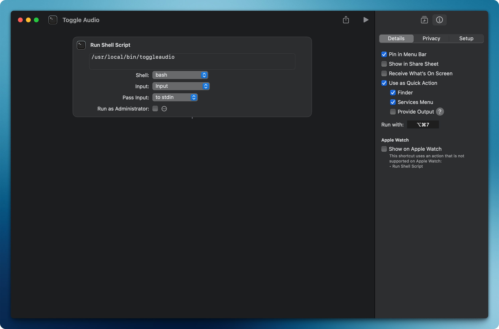

# Mac Audio Device Switcher

A simple macOS utility that allows you to quickly toggle between different audio output devices using a keyboard shortcut or menu bar item.

## Description

This tool provides a convenient way to switch between your Mac's speakers and another audio device (e.g., headphones, external speakers) with a single click or keyboard shortcut. It works by creating an Apple Shortcut that executes a shell script to toggle between two audio output devices.

## Prerequisites

- macOS 10.15 or later
- [Homebrew](https://brew.sh/) package manager
- switchaudio-osx (will be installed via Homebrew)

## Installation

1. Install Homebrew (if not already installed):
```bash
/bin/bash -c "$(curl -fsSL https://raw.githubusercontent.com/Homebrew/install/HEAD/install.sh)"
```

2. Install switchaudio-osx:
```bash
brew install switchaudio-osx
```

3. Download the `toggleaudio` script and make it executable:
```bash
sudo cp toggleaudio /usr/local/bin/
sudo chmod +x /usr/local/bin/toggleaudio
```

## Creating the Apple Shortcut

1. Open the Shortcuts app on your Mac
2. Click the + button to create a new shortcut
3. Click "Add Action"
4. Search for "Run Shell Script"
5. In the shell script action, enter: `toggleaudio`
6. Click the shortcut name at the top to rename it (e.g., "Toggle Audio")
7. Optional: Add to Menu Bar
- Click the (...) menu in the shortcut editor
- Select "Add to Menu Bar"

### Adding a Keyboard Shortcut

1. Go to System Settings > Keyboard > Keyboard Shortcuts
2. Select "Services" from the left sidebar
3. Find your shortcut under "General"
4. Click on "none" next to it and press your desired key combination

### Shortcuts app screenshot



## Usage

Once installed, you can switch audio devices by:
- Clicking the shortcut icon in the menu bar (if added)
- Using your assigned keyboard shortcut
- Running `toggleaudio` in Terminal

## Troubleshooting

1. If the script isn't working:
- Verify SwitchAudioSource is installed: `which SwitchAudioSource`
- Check available audio devices: `SwitchAudioSource -a`
- Run the script with debug mode: `DEBUG=1 toggleaudio`

2. If devices aren't switching:
- Verify the device names in the script match your system's device names
- Try switching manually: `SwitchAudioSource -s "Device Name"`
- Check the script permissions: `ls -l /usr/local/bin/toggleaudio`

3. If the shortcut isn't working:
- Make sure the script path is correct
- Try running the script directly in Terminal first
- Verify the shortcut's shell is set to "/bin/bash"

For additional help, check the current audio device:
```bash
SwitchAudioSource -c
```

